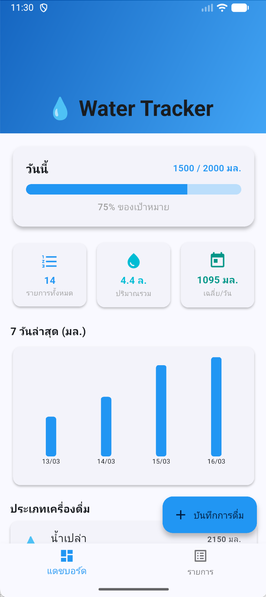
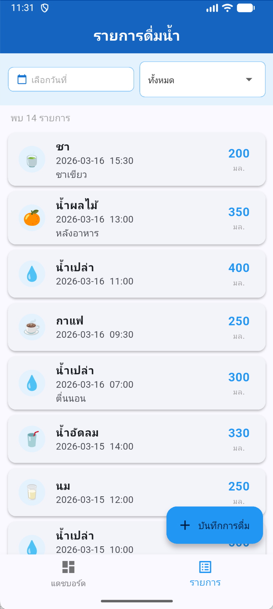
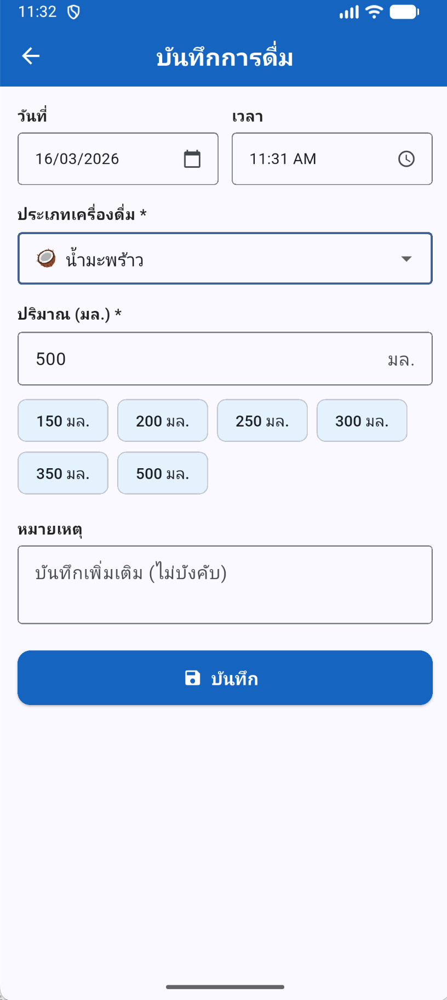
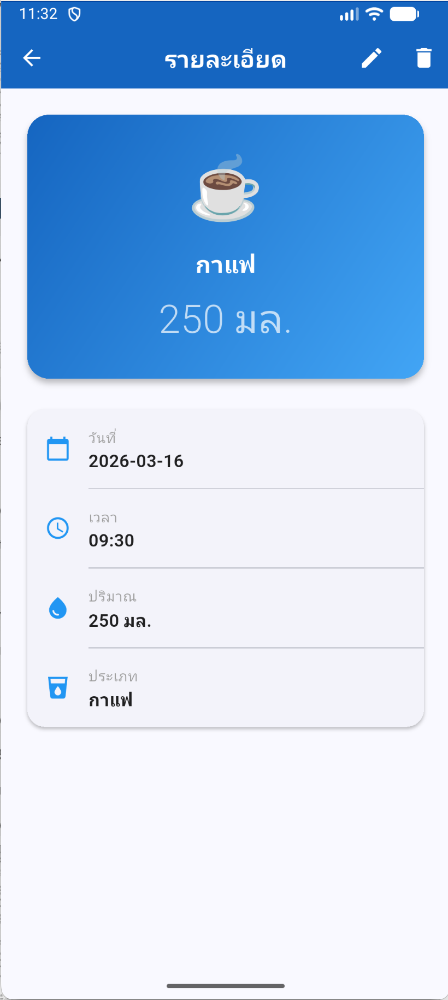

# 💧 Water Tracker App
### โจทย์ที่ 8: แอปบันทึกการดื่มน้ำ

---

## 👤 ชื่อผู้จัดทำ
นักศึกษา — กรุณาแก้ไขชื่อ/รหัสนักศึกษาที่นี่

---

## 📱 รายละเอียดฟังก์ชัน

| ฟีเจอร์ | รายละเอียด |
|--------|-----------|
| **เพิ่มข้อมูล** | บันทึกการดื่มน้ำพร้อม วันที่, เวลา, ปริมาณ, ประเภทเครื่องดื่ม, หมายเหตุ |
| **แก้ไขข้อมูล** | แก้ไขรายการที่บันทึกไว้ |
| **ลบข้อมูล** | ลบผ่านปุ่ม Delete หรือ Swipe (Dismissible) พร้อม Dialog ยืนยัน |
| **ค้นหา/กรอง** | กรองตามวันที่ (DatePicker) และประเภทเครื่องดื่ม (Dropdown) |
| **รายละเอียด** | หน้า Detail แสดงข้อมูลเต็มของแต่ละรายการ |
| **Dashboard** | แสดงจำนวนรายการ, ปริมาณรวม, ค่าเฉลี่ยต่อวัน, ความคืบหน้าวันนี้, กราฟ 7 วัน, สัดส่วนประเภทเครื่องดื่ม |
| **Validation** | ตรวจสอบข้อมูลครบถ้วนก่อนบันทึก |
| **Quick Amount** | ปุ่มเลือกปริมาณน้ำด่วน (150, 200, 250, 300, 350, 500 มล.) |

---

## 🗄️ โครงสร้างฐานข้อมูล (ER)

```
┌──────────────────────┐       ┌──────────────────────┐
│      drink_types     │       │      water_logs       │
├──────────────────────┤       ├──────────────────────┤
│ id (PK)              │       │ id (PK)              │
│ name (UNIQUE)        │◄──────│ drink_type (FK name) │
│ emoji                │       │ date (TEXT)          │
│ color_hex            │       │ time (TEXT)          │
└──────────────────────┘       │ amount_ml (INTEGER)  │
                               │ note (TEXT)          │
                               └──────────────────────┘
```

---

## 📦 Package ที่ใช้

```yaml
provider: ^6.1.1        # State Management
sqflite: ^2.3.0         # Local SQLite Database
path: ^1.9.0            # Database path helper
intl: ^0.19.0           # Date formatting
fl_chart: ^0.68.0       # Bar chart บน Dashboard
```

---

## 🏗️ โครงสร้างโปรเจกต์

```
lib/
├── main.dart
├── models/
│   ├── water_log.dart
│   └── drink_type.dart
├── providers/
│   └── water_log_provider.dart
├── services/
│   └── database_service.dart
└── screens/
    ├── dashboard_screen.dart   # Home + BottomNav
    ├── list_screen.dart        # รายการพร้อมกรอง
    ├── add_edit_screen.dart    # เพิ่ม/แก้ไข
    └── detail_screen.dart      # รายละเอียด
```

---

## 🚀 วิธีรันโปรเจกต์

```bash
# 1. Clone repository
git clone <repo-url>
cd water_tracker

# 2. ติดตั้ง dependencies
flutter pub get

# 3. รันบนเครื่อง
flutter run

# 4. Build APK
flutter build apk --release
```

> **Requirements:** Flutter SDK ≥ 3.0.0, Dart ≥ 3.0.0

---

## 📸 Screenshots
_(เพิ่มภาพหน้าจออย่างน้อย 4 ภาพ)_

| Dashboard | รายการ | เพิ่มข้อมูล | รายละเอียด |
|-----------|--------|------------|-----------|
|  |  |  |  |

---

## ⚙️ Package Name
`com.Pawaris.watertracker`  

